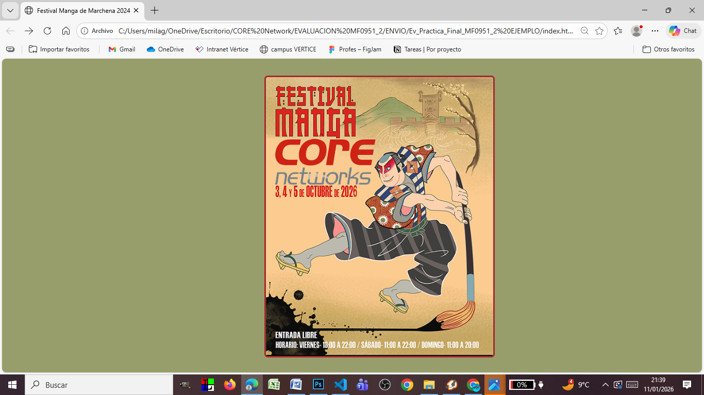
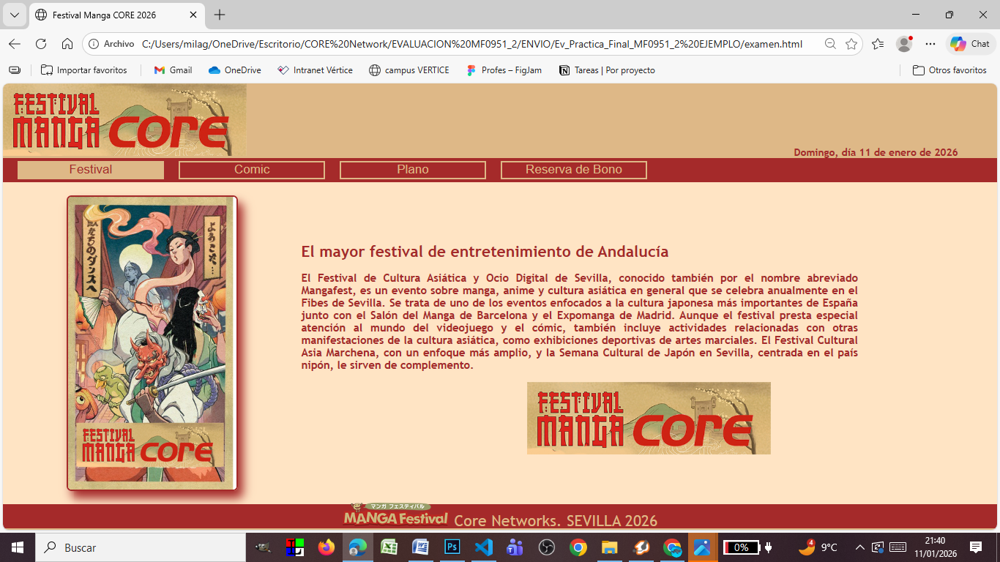
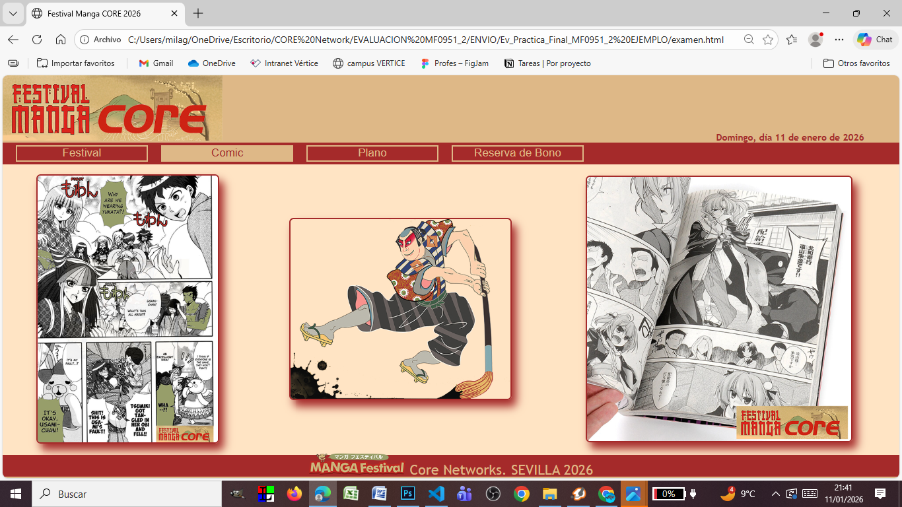
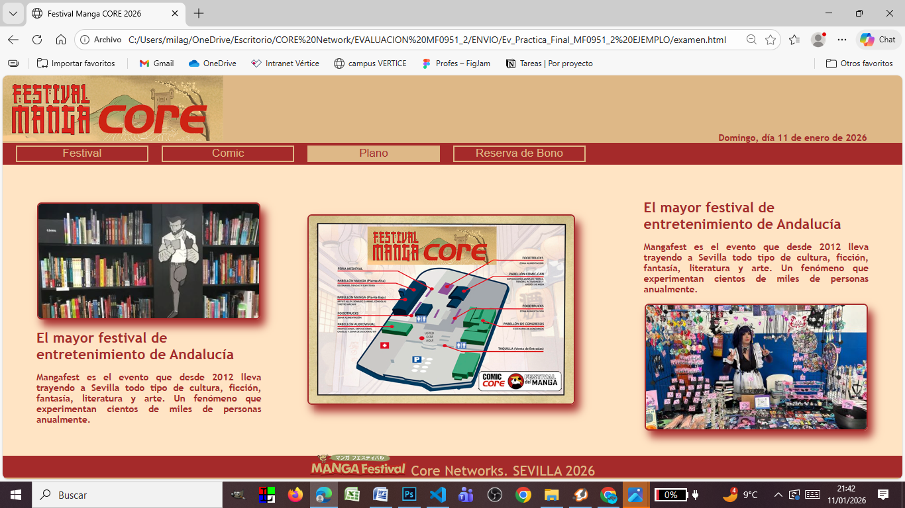

# Festival Manga Core 2026

[](https://github.com/Sarajesko/Manga-festival-Web/actions/workflows/ci.yml)

Mini sitio web del **Festival Manga Core 2026** (Sevilla): HTML, CSS y JavaScript vanilla. Portada con cartel, página principal con secciones internas y formulario de reserva de bono con validación en cliente.

**Repositorio:** [github.com/Sarajesko/Manga-festival-Web](https://github.com/Sarajesko/Manga-festival-Web)  
**Demo (GitHub Pages):** [sarajesko.github.io/Manga-festival-Web](https://sarajesko.github.io/Manga-festival-Web/)

---

## Índice

1. [¿Para qué sirve?](#para-qué-sirve)
2. [Qué incluye](#qué-incluye)
3. [Capturas](#capturas)
4. [Estructura](#estructura)
5. [Requisitos](#requisitos)
6. [Arranque rápido](#arranque-rápido)
7. [Uso del sitio](#uso-del-sitio)
8. [Secciones](#secciones)
9. [Validación del formulario](#validación-del-formulario)
10. [Stack](#stack)
11. [Solución de problemas](#solución-de-problemas)
12. [Roadmap](#roadmap)
13. [Licencia](#licencia)

---

## ¿Para qué sirve?

Presentar un evento de manga / cultura pop en formato web estática:

- portada con cartel clicable;
- navegación interna sin recargar la página (Festival, Comic, Plano, Reserva de bono);
- fecha actual en la cabecera;
- mapa embebido del lugar;
- reserva de bono con validación de nombre, apellido, email y mayoría de edad.

No necesita servidor ni build: abre los HTML en el navegador.

---

## Qué incluye

| Área | Estado |
|------|--------|
| Portada `index.html` → acceso a la página principal | Listo |
| Navegación por secciones (show/hide) | Listo |
| Fecha del día en cabecera | Listo |
| Galería / contenido Comic y Plano | Listo |
| Formulario de reserva con validación JS + regex | Listo |
| Google Maps embebido | Listo |
| Assets (CSS, JS, imágenes, favicon) | Listo |
| Sitio estático (sin backend) | Listo |
| CI GitHub Actions (checks en push/PR) | Listo |

---

## Capturas

| Portada / Festival | Comic | Plano | Reserva |
|--------------------|-------|-------|---------|
|  |  |  |  |

---

## Estructura

```
Manga-festival-Web/
├── index.html                 Portada (cartel)
├── examen.html                Página principal del festival
├── Asset/
│   ├── style.css              Estilos de la portada
│   ├── StyleExamen.css        Estilos de la página principal
│   ├── funcionalidadUno.js    Click del cartel → examen.html
│   ├── funcionalidadDos.js    Secciones, fecha, validación, hover
│   └── img/                   Imágenes, logos, iconos sociales
├── LICENSE
└── README.md
```

| Archivo | Rol |
|---------|-----|
| `index.html` | Landing con cartel |
| `examen.html` | Header, nav, 4 secciones, footer, mapa |
| `funcionalidadUno.js` | Redirección al hacer click en el cartel |
| `funcionalidadDos.js` | Tabs, `fechaHoy()`, `validaFormulario()`, hovers |

---

## Requisitos

| Herramienta | Para qué |
|-------------|----------|
| Navegador moderno | Chrome, Edge, Firefox, Safari |
| (Opcional) servidor local estático | Evitar restricciones al abrir por `file://` |

No hace falta Node, Python ni base de datos.

---

## Arranque rápido

### Opción A — Abrir el archivo

1. Abre `index.html` en el navegador (doble clic o arrastrar al navegador).
2. Haz click en el cartel → carga `examen.html`.

### Opción B — Servidor local (recomendado)

Desde la carpeta del repo:

```powershell
# Python
python -m http.server 5500
```

Luego abre [http://127.0.0.1:5500/index.html](http://127.0.0.1:5500/index.html).

### Opción C — Demo online

[https://sarajesko.github.io/Manga-festival-Web/](https://sarajesko.github.io/Manga-festival-Web/)

---

## Uso del sitio

1. **Portada** — click en el cartel manga.
2. **Festival** — sección por defecto al cargar.
3. **Comic** / **Plano** — galería y plano del evento.
4. **Reserva de bono** — completa el formulario y envía; si falla la validación, verás mensajes junto a cada campo.
5. Cabecera: fecha del día (día de la semana + día + mes + año).

---

## Secciones

| Botón | Sección | Contenido |
|-------|---------|-----------|
| Festival | `#seccionUna` | Cartel + texto introductorio |
| Comic | `#seccionDos` | Imágenes de cómic / manga |
| Plano | `#seccionTres` | Plano del recinto + textos |
| Reserva de bono | `#seccionCuatro` | Info de bonos + formulario + mapa |

La navegación solo cambia `display` de las secciones; no hay recarga de página.

---

## Validación del formulario

`onsubmit="return validaFormulario()"`. Campos:

| Campo | Reglas |
|-------|--------|
| Nombre | Obligatorio; empieza por mayúscula; 3–21 letras (con acentos/ñ) |
| Apellido | Obligatorio; uno o dos apellidos con el mismo patrón |
| E-mail | Obligatorio; formato `usuario@dominio.tld` |
| Edad | Obligatoria; **≥ 18** |

Si algo falla, se muestran mensajes en `#errorNombre`, `#errorApellido`, `#errorEmail`, `#errorEdad` y el envío se cancela.

> El `action` del formulario es `#`: **no hay backend**. La validación es solo en cliente.

---

## Stack

| Capa | Tecnología |
|------|------------|
| Marcado | HTML5 |
| Estilos | CSS (dos hojas: portada + página principal) |
| Lógica | JavaScript vanilla (DOM, regex, Date) |
| Mapa | Google Maps embebido (iframe) |
| Hosting demo | GitHub Pages |

---

## Solución de problemas

| Problema | Qué revisar |
|----------|-------------|
| Click en el cartel no hace nada | Que exista `examen.html` junto a `index.html`; consola del navegador |
| Secciones vacías / solapadas | `funcionalidadDos.js` cargado; IDs `seccionUna`…`seccionCuatro` |
| Fecha no aparece | Elemento `#laHora` y `DOMContentLoaded` |
| Validación no muestra errores | Spans `#errorNombre` etc. presentes; submit con `return validaFormulario()` |
| Imágenes rotas | Rutas relativas `./Asset/img/...` desde la raíz del repo |

---

## Roadmap

- Enviar la reserva a un endpoint real (API / email).
- Mejorar accesibilidad (semántica de botones, focus, ARIA).
- Unificar CSS y tipografías; responsive más fino en móvil.
- Corregir typo del favicon (`rel="shortcut icon"`).

---

## Licencia

[MIT](LICENSE) — software libre: puedes usar, modificar y redistribuir con la atribución correspondiente.

---

## Autor

**Pablo García Márquez**
